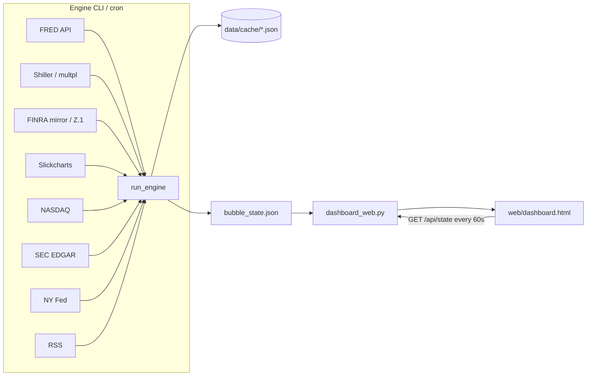

# Architecture

Flow: **engine (network + cache) → `data/cache/bubble_state.json` → read-only dashboard**. The UI does not download data.

## Separation of duties

| Component | Role | Network? |
|-----------|------|----------|
| `engine.run_engine` | Fetch, score, presentation, save state | Yes (24h cache) |
| `scripts/dashboard_web.py` | Serves HTML + JSON | No (disk only) |
| `web/dashboard.html` | Chart.js / cards / guides | No (reads local API) |
| `config/settings.json` | Thresholds, weights, feeds, flags | Read by engine |
| `.env` | `FRED_API_KEY`, `WEB_PORT` | Read by `config/env.py` |

## Engine pipeline (actual order in `run_engine.py`)

1. `fetch_fred_bundle` (+ `alt_macro` if series are stale / no key)
2. `fetch_cape` (Shiller XLS; if 404/stale → multpl; if that fails → seed 41.9)
3. `fetch_margin_debt` — **FINRA page → thetrading.tools CSV mirror → FRED Z.1 → seed**
4. `fetch_sp500_weights` (Slickcharts Mag7/Top10 + breadth sample)
5. Mag7 Yahoo (`fetch_yahoo_mag7: false` → no-op) + `fetch_mag7_nasdaq`
6. `fetch_mag7_earnings` (NASDAQ surprise)
7. `fetch_spx_drawdown` (FRED `SP500`)
8. `fetch_mag7_8k` (SEC atom)
9. `fetch_recession_prob` (NY Fed XLS — needs `xlrd`)
10. `fetch_news_digest` (RSS)
11. `fetch_market_breadth` (SPY vs RSP + top-N NASDAQ quotes) — **the slow step**
12. `build_under_surface`
13. `assemble_indicators` → blend `ai_earnings_risk` (news 0.25 + EPS 0.55 + 8-K 0.20)
14. `build_scores` → `enrich_state` → save `bubble_state.json`

Fail-soft for each fetch: exception → previous JSON cache → `empty_fallback` / seed payload. The engine still exits 0 if sources are dead; check `data_quality` and `still_seed`.

## Cache

- Path: `data/cache/` (gitignored except `.gitkeep`)
- Freshness: file mtime vs `cache_max_age_hours` (`is_cache_fresh`)
- `--force` ignores freshness and refetches
- UI output: `bubble_state.json`

## Ports

- Dashboard default **8891** (`WEB_PORT`) — bind `0.0.0.0`
- igedge often uses 8890

## Do not confuse repos

A historical folder `SP500-bubble-monitor` exists. Open **only** `SP500-ai-bubble-monitor`. The server prints this at startup.
