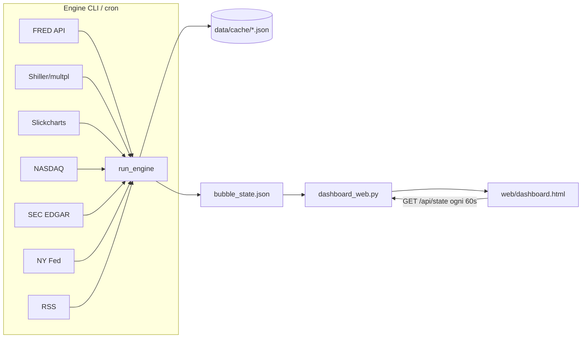

# Architecture

## Flusso

## Separazione responsabilità

| Componente | Ruolo | Rete? |
|------------|-------|-------|
| `engine.run_engine` | Fetch, score, presentation, salva state | Sì (con cache) |
| `scripts/dashboard_web.py` | Serve HTML + JSON | No (solo disco) |
| `web/dashboard.html` | Render Chart.js / card / guide | No (legge API locale) |

## Pipeline engine (ordine tipico)

1. `fetch_fred_bundle` (+ alt_macro fallback)  
2. `fetch_cape`  
3. `fetch_margin_debt` (Z.1 → FINRA → seed)  
4. `fetch_sp500_weights`  
5. Mag7 Yahoo (off) + `fetch_mag7_nasdaq`  
6. `fetch_spx_drawdown`, `fetch_mag7_8k`, recession, news  
7. `build_under_surface`  
8. `assemble_indicators` → `build_scores` → `enrich_state`  
9. Salva `bubble_state.json`

Fail-soft: eccezione → cache precedente → seed/empty.

## Porte

- Dashboard default **8891** (`WEB_PORT`) — igedge usa spesso 8890.
