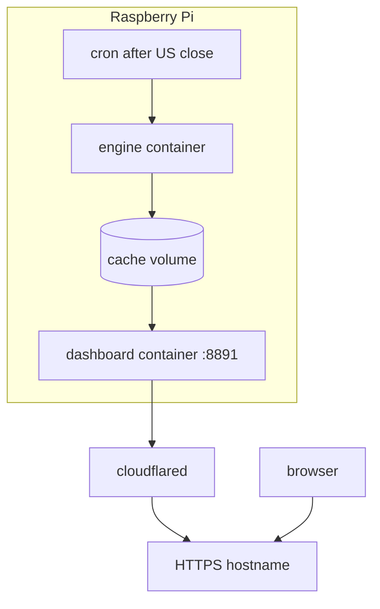

# Docker and production (target)

**Code status:** Docker, Pi cron, and the tunnel are **not in the repo yet** (no `Dockerfile` / compose / `scripts/pi/`). This page is the deploy contract + checklist. Implementation: [`evolutive/13-docker-tunnel-docs-rename.md`](../evolutive/13-docker-tunnel-docs-rename.md).

Related docs:

- Config: [configuration.md](configuration.md)
- Pi: [ops-raspberry-pi.md](ops-raspberry-pi.md)
- Tunnel: [cloudflare-tunnel.md](cloudflare-tunnel.md)
- Incidents: [runbook-incidenti.md](runbook-incidenti.md)

## Goals

1. Everything in Docker (always-on dashboard + on-demand engine)
2. **Automatic** fetch in production (cron), never from the UI
3. HTTPS via **Cloudflare Tunnel** (Gamtrace pattern)
4. Persistent `data/cache` volume on the Pi
5. Windows PC = pytest + UI on cache; no `--force` loops



## Draft compose (to implement — not in the repo)

```yaml
# draft — create docker-compose.yml when doing evolutive/13
services:
  dashboard:
    build: .
    ports: ["8891:8891"]
    env_file: .env
    environment:
      TZ: Europe/Rome
    volumes:
      - bubble-cache:/app/data/cache
    restart: unless-stopped
    healthcheck:
      test: ["CMD", "python", "-c", "import urllib.request; urllib.request.urlopen('http://127.0.0.1:8891/salute')"]
      interval: 30s
      timeout: 5s
      retries: 3
  engine:
    build: .
    profiles: ["manual"]
    env_file: .env
    environment:
      TZ: Europe/Rome
    volumes:
      - bubble-cache:/app/data/cache
    command: ["python", "-m", "engine.run_engine"]
volumes:
  bubble-cache:
```

Host cron (once compose exists):

```bash
# evening, after US close — Europe/Rome
0 22 * * 1-5 cd /home/pi/SP500-ai-bubble-monitor && docker compose --profile manual run --rm engine
```

`--force` only on a dedicated weekly job, not the daily cron.

## Go-live checklist (when Docker exists)

1. `.env` on the Pi with `FRED_API_KEY`, never in git
2. `docker compose build && docker compose up -d dashboard`
3. `curl -s http://127.0.0.1:8891/salute` → `ok`
4. First `docker compose --profile manual run --rm engine` (minutes; breadth is slow)
5. `curl -s http://127.0.0.1:8891/api/state` → `_trust` is not `fixture`; `alert.headline` present; `data_quality.fred_api_key_present: true`
6. Confirm recent `cape_as_of` and FINRA/mirror `margin_source`
7. Cloudflare Tunnel to `http://127.0.0.1:8891` — [cloudflare-tunnel.md](cloudflare-tunnel.md)
8. Engine cron + logs
9. Open the hostname: not a fixture badge, no fetch button

Until Docker exists, local go-live = [development.md](development.md) + one engine run + dashboard 8891.

## Windows rule

Do not use the development PC as a fetch farm. Tests = pytest + UI on cache. An occasional live fetch is fine; repeated `--force` is not.
